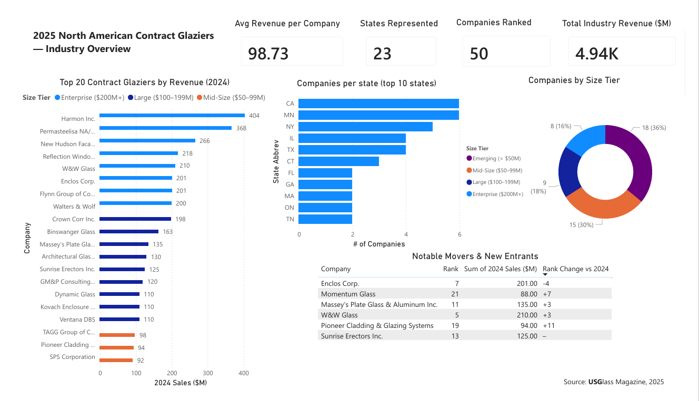

# 2025 North American Contract Glaziers — Power BI Dashboard
## Project Overview
This dashboard was built to transform a static industry ranking into an interactive analytical tool that allows users to explore revenue distribution, geographic concentration, company size tiers, and year-over-year rank movement across the contract glazing industry.
The underlying data was sourced from USGlass Magazine's 2025 Top 50 Contract Glaziers report, which ranks companies by annual revenue based on self-reported financials and field estimates from Key Media & Research.

## Dashboard Features
### KPI Cards — at-a-glance industry summary including average revenue per company, states represented, total companies ranked, and total industry revenue
- **Top 20 Bar Chart** — horizontal bar chart of the 20 largest companies by 2024 revenue, color-coded by size tier
- **Companies by State** — geographic distribution of Top 50 headquarters across U.S. states and Canadian provinces
- **Size Tier Donut Chart** — breakdown of the 50 companies into four revenue tiers: Enterprise ($200M+), Large ($100–199M), Mid-Size ($50–99M), and Emerging (under $50M)
- **Notable Movers & New Entrants** — table highlighting companies with significant rank changes and first-time list entrants

## Data
The Excel workbook (Top50_Glaziers_PowerBI_Ready.xlsx) contains three worksheets used as the data source:

| Sheet | Contents |
|-------|----------|
| Company Rankings | All 50 companies with rank, revenue, headquarters, region, size tier, years in business, rank change, and notable flag |
| State Summary | Aggregated company count and revenue totals by state |
| KPI Summary | Pre-calculated headline metrics |

The Company Rankings sheet was enriched with several derived columns beyond the original published data:

**Region** — U.S. Census-based regional grouping (Northeast, South, Midwest, West, Canada)  
**Size Tier** — revenue-based classification into four tiers  
**Rank Change vs 2024** — year-over-year rank movement  
**Notable** — flag for significant movers and new entrants

## Tools Used

Microsoft Power BI Desktop
Microsoft Excel (data preparation)

## Files
- [Dataset (.xlsx)](Top50_Glaziers_PowerBI_Ready.xlsx)

## Data Source
Rankings originally published in:

The Top 50: USGlass Magazine's 2025 Rankings of the Largest Contract Glaziers
**USG**lass Magazine, February 2025
[https://www.usglassmag.com/the-top-50-usglass-magazines-2025-rankings-of-the-largest-contract-glaziers/
](url)
Data reflects self-reported 2024 annual revenues. Companies marked with an asterisk in the original publication did not provide financial data; figures for those companies are estimated by Key Media & Research based on field reports.
